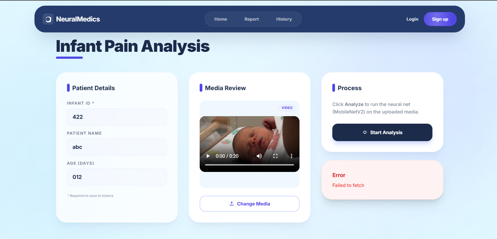
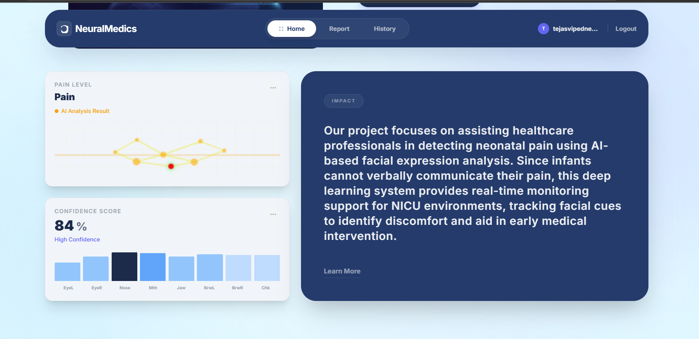
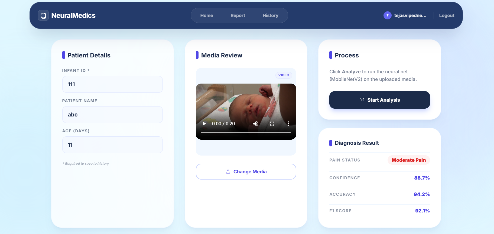
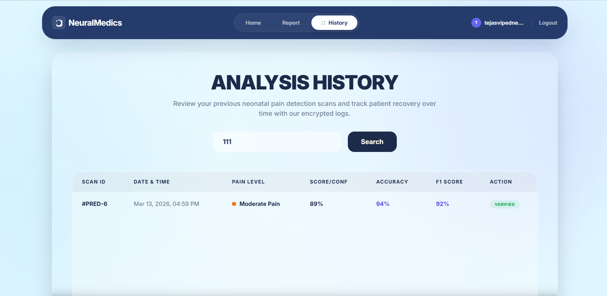
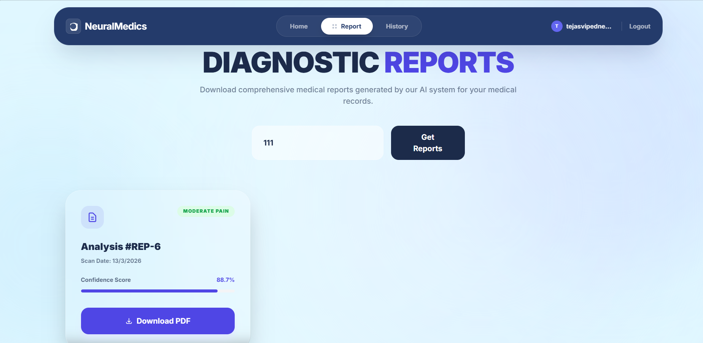

# Neonatal-Pain-Recognition
Since infants cannot verbally communicate their discomfort, recognizing neonatal pain is a significant challenge. NeuralMedics supports pediatric care by enabling early, objective detection of pain through AI expression analysis, assisting healthcare professionals in delivering prompt, accurate interventions  

## Project Output

.png)

